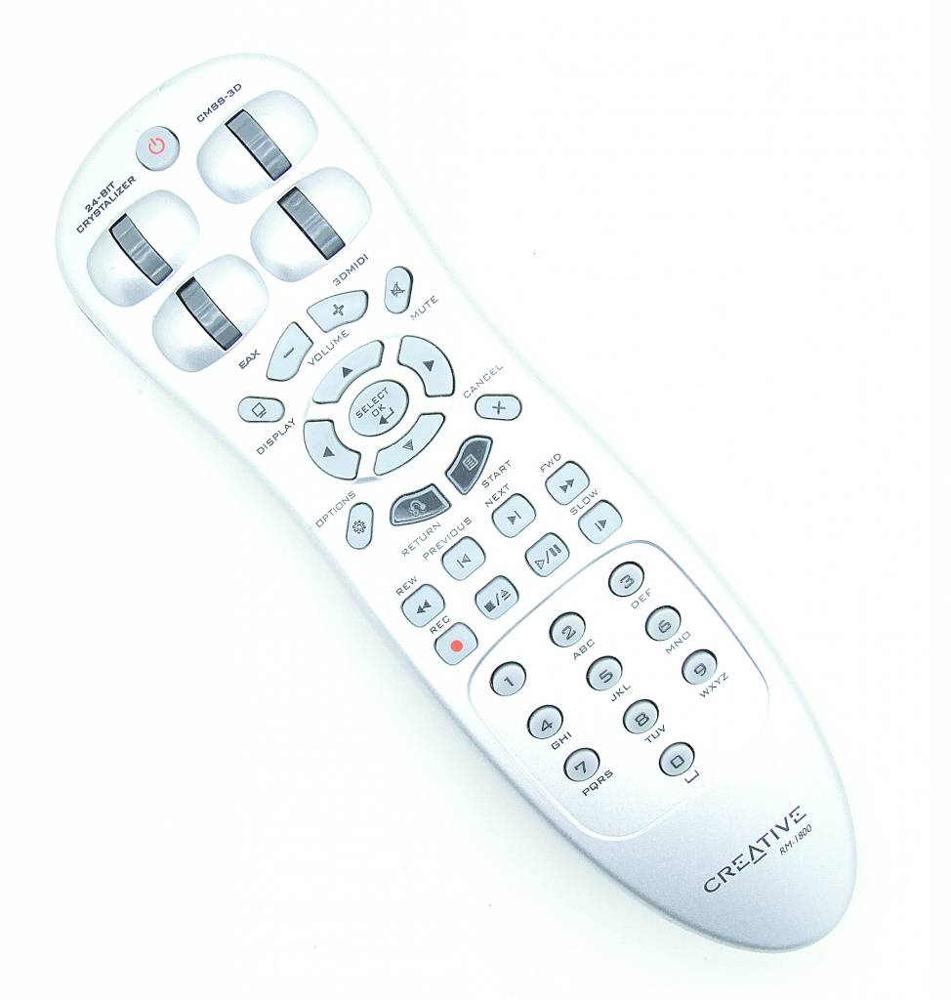

# Creative SB0540 infrared receiver Linux driver

Compile with `make` and install with `make install` (the latter as root or
through `sudo`).

After a reboot, the driver should be loaded automatically when the dongle
gets plugged in.

Note that operation under kernels older than 4.17 might require
more work as special drivers work differently.

